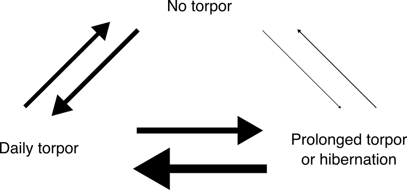
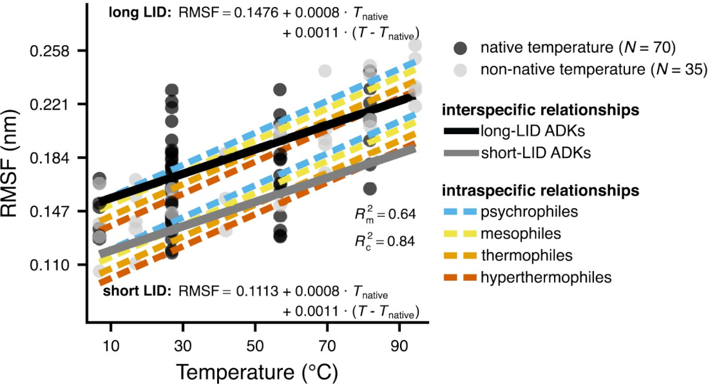
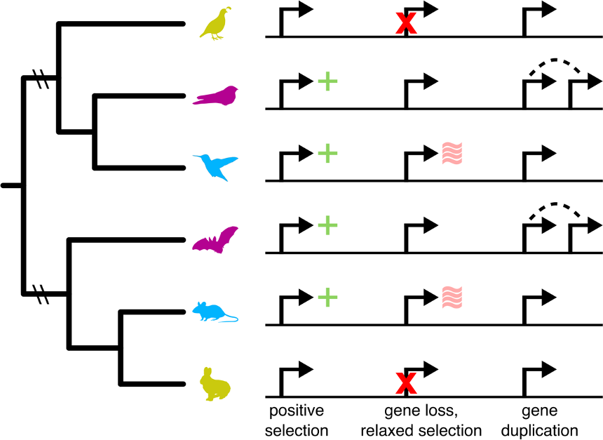
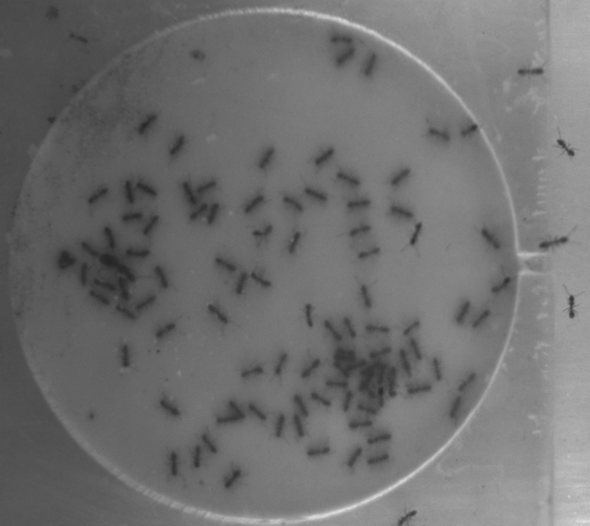

Climate change is among the most important threats to global biodiversity. 
To accurately forecast its impacts on the biosphere, it is important to 
develop a thorough understanding of <b>current and historical responses of diverse biological systems to environmental changes</b>.

  

To make progress toward this goal, I work across levels of organization 
(from molecules to ecosystems), timescales (from seconds to millions of years), 
and taxonomic groups (bacteria, invertebrates, birds, and mammals).

  

The main themes of my research to date are:
 

<b>1. Evolutionary adaptation of physiological traits to environmental factors</b>

<b>1A. Ectotherms</b> 

In ectotherms, the performance of physiological traits (e.g., respiration) is 
typically a unimodal function of temperature. The shape of this relationship 
exhibits remarkable variation across traits, taxa, and environments. To better understand how such variation 
emerges, I perform phylogenetic meta-analyses of large empirical datasets, accounting for 
key environmental factors.

  
Selected key publications:<ul style="margin-left: 40px; padding-left: 20px; text-align: justify">
<li>Kontopoulos, D.-G., Sentis, A., Daufresne, M., Glazman, N., Dell, A.I., and Pawar, S. (2024). 
<a href='../publication/15_No_universal_mathematical_model'>No universal 
mathematical model for thermal performance curves across traits and taxonomic groups.</a> 
Nature Communications 15:8855.</li>
<li>Kontopoulos, D.-G., Smith, T.P., Barraclough, T.G., and Pawar, S. (2020). 
<a href='../publication/10_Adaptive_evolution_shapes'>Adaptive evolution
shapes the present-day distribution of the thermal sensitivity of
population growth rate.</a> PLOS Biology 18(10):e3000894.</li>
<li>Kontopoulos, D.-G., van Sebille, E., Lange, M., Yvon-Durocher, G., 
Barraclough, T.G., and Pawar, S. (2020).
<a href='../publication/09_Phytoplankton_thermal_responses_adapt'>Phytoplankton
thermal responses adapt in the absence of hard thermodynamic constraints.</a>
Evolution 74(4):775-790.</li>
</ul>

&nbsp;

<b>1B. Endotherms</b> 

Many endotherms have the ability to enter torpor (daily torpor, prolonged torpor, or hibernation) 
in response to challenging environmental conditions (e.g., low food resources, extreme temperatures). 
To shed light on the physiological, ecological, and environmental factors that promote evolutionary shifts in torpor use 
in mammalian and avian clades, I apply phylogenetic comparative methods 
to large torpor classification datasets.

  
Selected key publications:<ul style="margin-left: 40px; padding-left: 20px; text-align: justify">
<li><a href='../publication/16_Numerous_independent_gains'>Numerous 
independent gains of daily torpor and hibernation across endotherms, linked with 
adaptation to diverse environments.</a> Functional Ecology 39(3):824-839.</li>
</ul>

 

<b>2. Signatures of environmental adaptation at the molecular level</b>

<b>2A. Enzyme structures</b> 

Orthologous enzymes tend to reflect the environmental conditions that their 
species experience, especially in ectotherms whose body temperature fully depends 
on the environment. To understand how the three-dimensional structures of 
enzymes change through adaptation to different environments, I combine 
molecular dynamics simulations with phylogenetic comparative methods.

  
Selected key publications:<ul style="margin-left: 40px; padding-left: 20px; text-align: justify">
<li>Kontopoulos, D.-G., Patmanidis, I., Barraclough, T.G., and Pawar, S. (2025). 
<a href='../publication/18_Changes_in_flexibility_but_not'> Changes in 
flexibility but not in compactness underlie the thermal adaptation of 
prokaryotic adenylate kinases.</a> Evolution Letters qraf026.</li>
</ul>

&nbsp;

<b>2B. Genes</b> 

At the genomic level, genes associated with a particular trait (e.g., hibernation) may
exhibit various evolutionary patterns, such as positive selection, 
evolutionary rate shifts, or even gene loss in lineages where the trait 
is also lost. Thus, I perform genome-wide screens for such molecular 
patterns to uncover the genomic underpinnings of environmental adaptation.

 

<b>3. Environmental effects on social behavior</b>

Social behavior is widespread in the animal kingdom because it can 
significantly improve the survival and reproductive success of individuals, 
influence the dynamics of entire populations, and their interactions with 
other species. We still have a poor understanding of the effects of 
environmental factors (e.g., temperature) on social behavior. To address 
this, I sample Argentine ants (<i>Linepithema humile</i>) from natural 
colonies and monitor their social behavior during experiments at different 
temperature and humidity levels.

