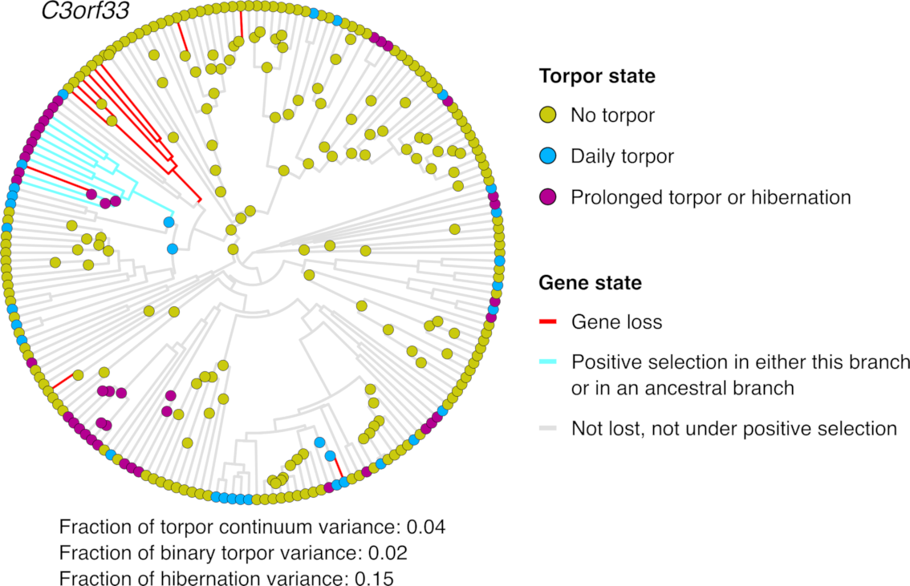

{{ page.title }} 
 

### Abstract:

Torpor is a key survival strategy that many avian and mammalian lineages 
evolved in response to challenging environmental conditions. Whether the 
independent evolution of torpor in different lineages involved changes 
in the same genes remains poorly understood. Here, we performed 
comparative screens across 190 placental mammal genomes to comprehensively 
examine associations between loss, positive selection and evolutionary 
rate shifts in individual protein-coding genes and evolutionary shifts 
in torpor use. We find that gene-torpor associations are highly 
clade-specific, with no gene being able to explain the majority of torpor 
shifts across the phylogeny of placental mammals. Instead, a relatively 
higher but limited extent of evolutionary convergence can be detected at 
the pathway level. Our results suggest that torpor emerged through several 
genetic routes in placental mammals, which likely explains the vast 
diversity of torpor use patterns that can be observed among torpor-capable 
species today.

[Full text](https://doi.org/10.1101/2025.11.18.689136)
\| [Code](https://codeberg.org/dgkontopoulos/Kontopoulos_et_al_torpor_genomics_placental_mammals)
\| [Data](https://doi.org/10.6084/m9.figshare.30603461.v1)
\| [citation](../bibtex/01_Comparative_genomics_indicate.bib)
