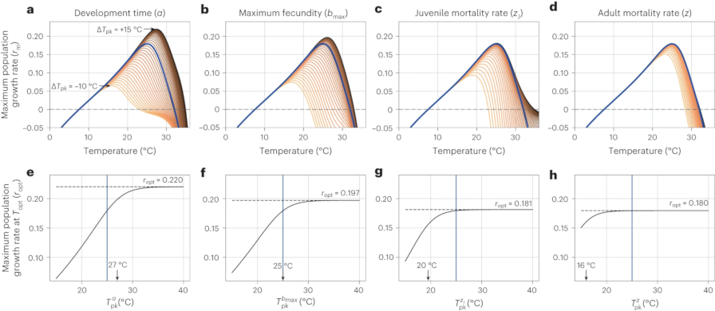

{{ page.title }} 
 

### Abstract:

The degree to which arthropod populations will be able to adapt to 
climatic warming is uncertain. Here, we report that arthropod thermal 
adaptation is likely to be constrained in two fundamental ways. First, 
maximization of population fitness with warming is predicted to be 
determined predominantly by the temperature of peak performance of 
juvenile development rate, followed by that of adult fecundity, 
juvenile mortality and adult mortality rates, in this specific order. 
Second, the differences among the temperature of peak performance of 
these four traits will constrain adaptation. By compiling a new global 
dataset of 61 diverse arthropod species, we show that contemporary 
populations have indeed evolved under these constraints. Our results 
provide a basis for using relatively feasible trait measurements to 
predict the adaptive capacity of arthropod populations to climatic warming.

[Full text](https://doi.org/10.1101/2023.01.18.524448)
