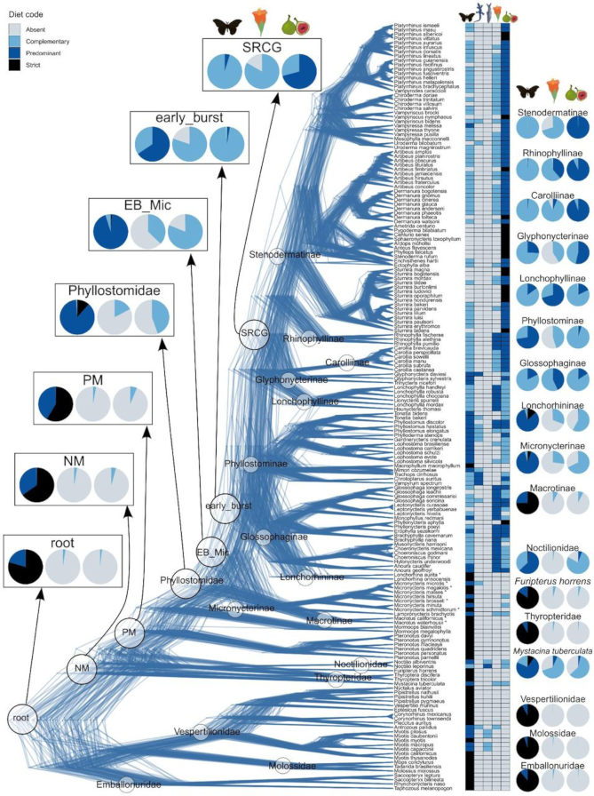

{{ page.title }} 
 

### Abstract:

Adaptive radiations often occur with an early burst of ecological 
diversification, which requires not only various available niches but 
also a generalist ancestor with wide ecological niche breadths. However, 
ancestral generalism remains hard to test in empirical cases. The New 
World leaf-nosed bats (family Phyllostomidae) represent an unparalleled 
mammalian adaptive radiation with diverse dietary niches including 
arthropods, blood, terrestrial vertebrates, nectar, and fruits. However, 
when and how often phyllostomid bats transitioned from insectivory to 
fruit or nectar feeding remains unclear. Here we tested the hypotheses 
of ancestral insectivory versus ancestral omnivory in Phyllostomidae 
(141 species) using improved trait reconstructions based on multi-response 
phylogenetic threshold models, while explicitly accounting for phylogenetic 
uncertainty. Our results indicate that complementary fruit feeding has 
fully evolved at the early burst of the phyllostomid radiation and 
started to evolve in the most recent common ancestor of the family, 
supporting the ancestral omnivory hypothesis. In addition, fruit feeding 
probably evolved before nectar eating in Phyllostomidae, in contrast to 
the claims of previous studies. Extending this analysis to all bat 
families (621 species) reveals independent evolution of ancestral fruit 
feeding in four families, namely the Pteropodidae (Old World fruit bats) 
and three families from the Noctilionoidea superfamily. Despite the 
ancestral omnivory of these fruit-eating families, only Phyllostomidae 
and Pteropodidae show high species diversity and evolved predominant and 
strict fruit feeding. Therefore, our results reveal that ancestral 
generalism (i.e., omnivory) may be a precondition of but does not 
necessarily lead to adaptive radiations which also require subsequent 
niche partitioning and speciation.

[Full text](https://doi.org/10.1101/2025.02.04.636560)
