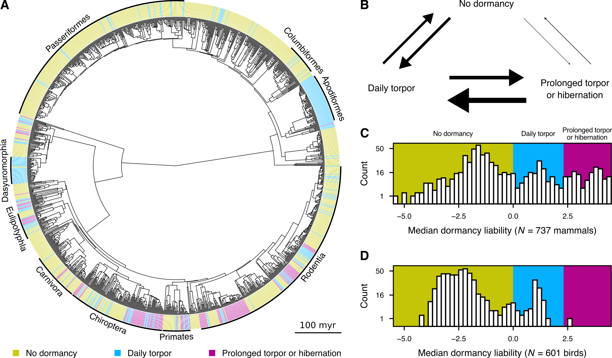

{{ page.title }} 
 

### Abstract:

Many endotherms from diverse taxonomic groups can respond to 
environmental changes through dormancy, i.e., by greatly reducing their 
energy expenditure for up to 24 hours (daily torpor) or longer 
(hibernation). We currently have a poor understanding of how dormancy 
evolved across endotherms and its associations with physiological 
traits and ecological factors. To fill this gap, we thoroughly examine 
the evolutionary patterns of dormancy and its links with 21 key 
ecophysiological variables across 1,338 extant endotherms. We find that 
daily torpor and hibernation are parts of a dormancy continuum, and 
that there are several, albeit weak, associations between dormancy and 
species' physiological or environmental characteristics. Furthermore, 
we show that early endotherm ancestors likely did not hibernate and 
that this trait evolved multiple times in independent lineages. 
Overall, our results provide an explanation for the remarkable 
variation in dormancy patterns, even among species occupying highly 
similar niches.

[Full text](https://doi.org/10.1101/2023.12.12.571278)
