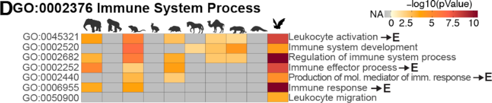

{{ page.title }} 
 

### Abstract:

Bats carry viruses that can cause severe disease in other mammals. 
Asymptomatic infections in bats suggest limited tissue-damaging 
inflammation and immunopathology. To investigate the genomic basis of 
disease resistance, the Bat1K project generated reference-quality 
genomes of ten bat species. A systematic analysis showed that 
signatures of selection in immune genes are more prevalent in bats 
compared with other mammals. We found an excess of immune gene 
adaptations in the ancestral Chiroptera and many descending bat 
lineages, highlighting viral entry and detection factors, and 
regulators of antiviral and inflammatory responses. ISG15, an 
antiviral gene contributing to hyperinflammation during COVID-19, 
exhibits a deletion of a cysteine, required for homodimer formation, 
in rhinolophid and hipposiderid bats. Cellular infection experiments 
showed enhanced intracellular protein conjugation of bat ISG15 and 
lack of secretion into extracellular space, where human ISG15 
stimulates inflammation. Our work highlights molecular mechanisms 
contributing to viral tolerance and disease resistance in bats.

[Full text](https://doi.org/10.21203/rs.3.rs-2557682/v1)
