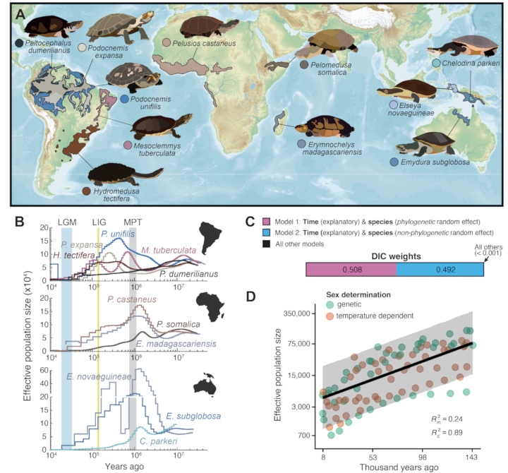

{{ page.title }} 
 

### Abstract:

Turtles exhibit a highly derived body plan, exceptional longevity, 
cancer resistance, and striking diversity in karyotypes and sex determination 
systems. However, the genomic basis of these innovations remains unresolved, 
largely because reference genomes were lacking for one of two extant 
turtle clades, the side-necked turtles (Pleurodira). As part of the 
Vertebrate Genomes Project, we generated seven reference-quality 
Pleurodira genomes and reconstructed the most comprehensive genome-wide 
turtle phylogeny. Combining demographic inference with historical climate 
and biome reconstructions indicates that ancient climate fluctuations 
shaped long-term population dynamics, while recent declines mainly reflect 
population structure.Ancestral genome reconstructions reveal that rare 
bursts of chromosome fusions and fissions, likely facilitated by repetitive 
elements, drove turtle karyotype diversity. By identifying sex chromosomes 
and tracing their evolutionary history, we resolve a long-standing debate 
and demonstrate a single origin of genetic sex determination in Chelidae 
on a microchromosome over 80 million years ago. Contrary to previous 
hypotheses, we find no evidence of coevolution between genetic sex 
determination and chromosome number in turtles. Comparative genomic 
analyses further identify gene losses and signatures of adaptive evolution 
associated with key turtle traits. Gene losses causing disproportionate 
dwarfism phenotypes may have contributed to skeletal adaptations underlying 
the compact turtle body plan. In addition, gene losses and adaptive changes 
in stress response and tumor suppressor pathways likely enhance oxidative 
stress tolerance and cancer resistance. Together, these findings illuminate 
turtle genome evolution, revealing chromosomal dynamics, sex chromosome 
evolution, molecular insights into skeletal innovation and cancer resistance, 
and implicate gene losses as a recurrent contributor to evolutionary novelty.

[Full text](https://doi.org/10.64898/2026.03.05.709825)
\| [citation](../bibtex/02_Side_necked_turtle_genomes.bib)
