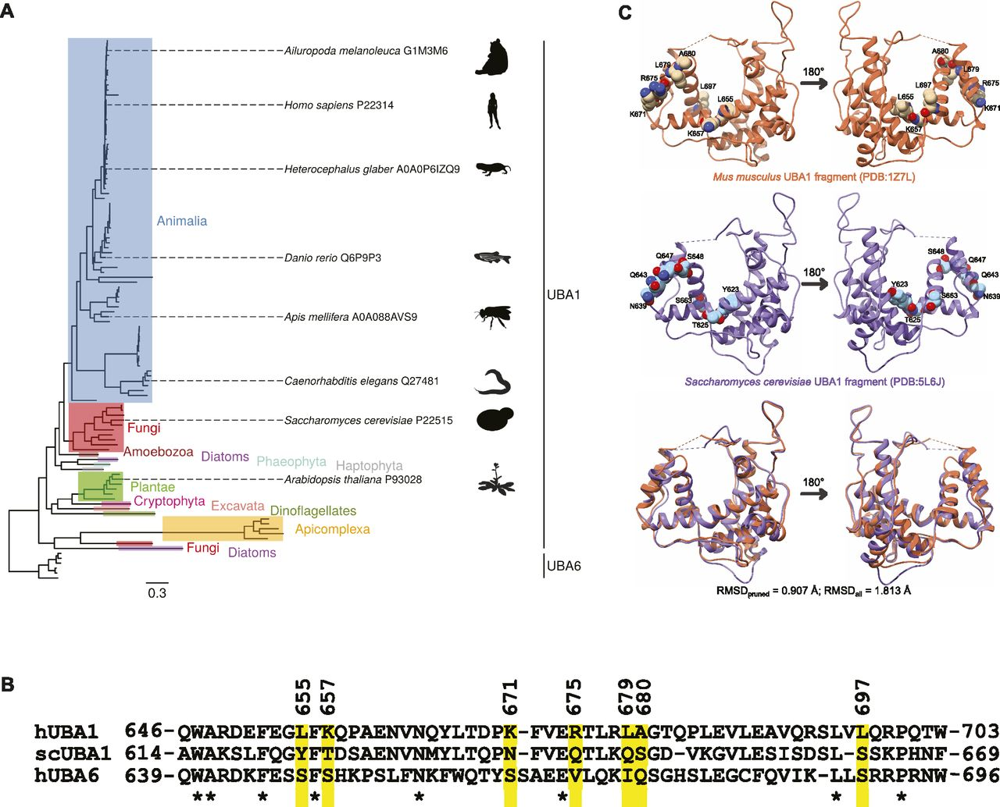

{{ page.title }} 
 

### Abstract:

The DNA damage response (DDR) ensures cellular adaptation to genotoxic 
insults. In the crowded environment of the nucleus, the assembly of 
productive DDR complexes requires multiple protein modifications. How 
the apical E1 ubiquitin activation enzyme UBA1 integrates spatially and 
temporally in the DDR remains elusive. Using a human cell-free system, 
we show that poly(ADP-ribose) polymerase 1 promotes the recruitment of 
UBA1 to DNA. We find that the association of UBA1 with 
poly(ADP-ribosyl)ated protein–DNA complexes is necessary for the 
phosphorylation replication protein A and checkpoint kinase 1 by the 
serine/threonine protein kinase ataxia-telangiectasia and RAD3-related, 
a prototypal response to DNA damage. UBA1 interacts directly with 
poly(ADP-ribose) via a solvent-accessible and positively charged patch 
conserved in the Animalia kingdom but not in Fungi. Thus, ubiquitin 
activation can anchor to poly(ADP-ribose)-seeded protein assemblies, 
ensuring the formation of functional ataxia-telangiectasia mutated and 
RAD3-related-signalling complexes.

[Full text](https://www.life-science-alliance.org/content/1/3/e201800096)
\| [citation](../bibtex/7_Recruitment_of_ubiquitin.bib)
