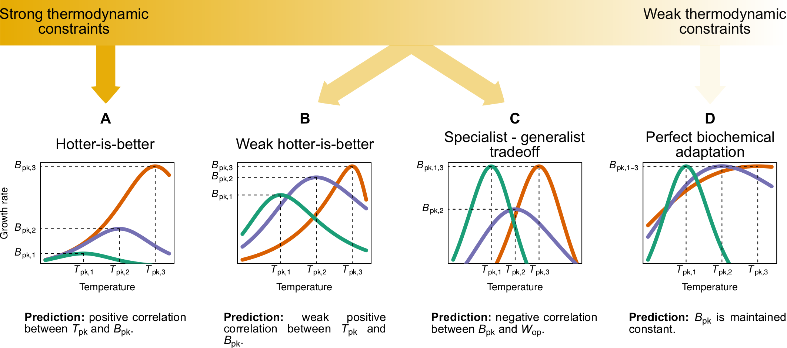

 

### Abstract:

To better predict how populations and communities respond to climatic 
temperature variation, it is necessary to understand how the shape of 
the response of fitness-related traits to temperature evolves (the 
thermal performance curve). Currently, there is disagreement about the 
extent to which the evolution of thermal performance curves is constrained. 
One school of thought has argued for the prevalence of thermodynamic 
constraints through enzyme kinetics, whereas another argues that 
adaptation can - at least partly - overcome such constraints. To shed 
further light on this debate, we perform a phylogenetic meta-analysis 
of the thermal performance curve of growth rate of phytoplankton - a 
globally important functional group -, controlling for potential 
environmental effects (habitat type and thermal regime). We find that thermodynamic constraints have a 
minor influence on the shape of the curve. In particular, we detect a 
very weak increase of maximum performance with the temperature at 
which the curve peaks, suggesting a weak "hotter-is-better" constraint. 
Also, instead of a constant thermal sensitivity of growth across species, 
as might be expected from strong constraints, we find that all aspects of 
the thermal performance curve evolve along the phylogeny. Our results suggest 
that phytoplankton thermal performance curves adapt to thermal 
environments largely in the absence of hard thermodynamic constraints.

[Full text](https://doi.org/10.1101/452250)
\| [citation](../bibtex/9_Phytoplankton_thermal_responses_adapt.bib)
