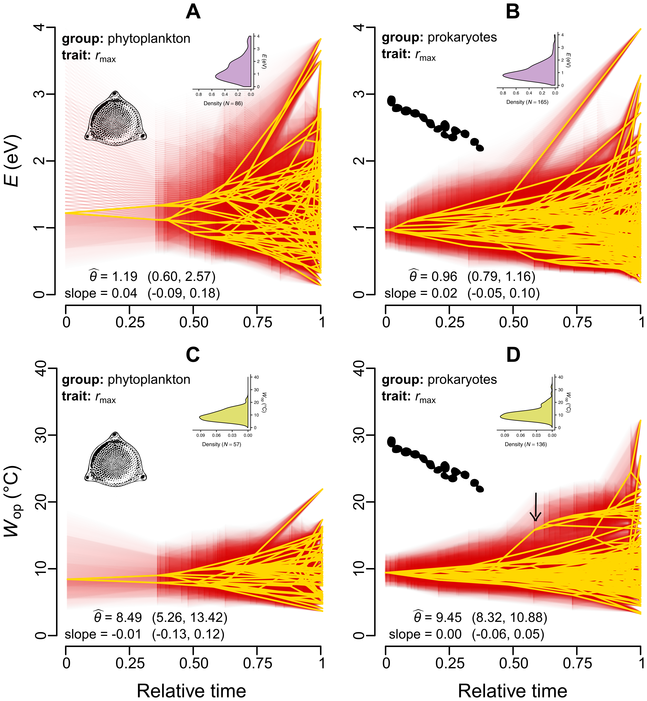

 

### Abstract:

Developing a thorough understanding of how ectotherm physiology adapts 
to different thermal environments is of crucial importance, especially 
in the face of climate change. In particular, the study of how the 
relationship between trait performance and temperature (the "thermal 
performance curve"; TPC) evolves has been receiving increasing attention 
over the past years. A key aspect of the TPC is the thermal sensitivity, 
i.e., the rate at which trait values increase with temperature within 
temperature ranges typically experienced by the organism. For a given 
trait, the distribution of thermal sensitivity values across species is 
typically right-skewed. The mechanisms that underlie the shape of this 
distribution are hotly debated, ranging from strongly thermodynamically 
constrained evolution to adaptive evolution that can partly overcome 
thermodynamic constraints. Here we take a phylogenetic comparative 
approach and examine the evolution of the thermal sensitivity of 
population growth rate across phytoplankton and prokaryotes. We find 
that thermal sensitivity is moderately phylogenetically heritable and 
that the shape of its distribution is the outcome of frequent 
evolutionary convergence. More precisely, bursts of rapid evolution in 
thermal sensitivity can be detected throughout the phylogeny, increasing 
the amount of overlap among the distributions of thermal sensitivity of 
different clades. We obtain qualitatively similar results from 
evolutionary analyses of the thermal sensitivities of two underlying 
physiological traits, net photosynthesis rate and respiration rate of 
plants. Finally, we show that part of the variation in thermal 
sensitivity is driven by latitude, potentially as an adaptation to the 
magnitude of temperature fluctuations. Overall, our results indicate 
that adaptation can lead to large shifts in thermal sensitivity, 
suggesting that attention needs to be paid towards elucidating the 
implications of these evolutionary patterns for ecosystem function.

[Full text](https://doi.org/10.1101/712885)
\| [citation](../bibtex/10_Adaptive_evolution_explains.bib)
