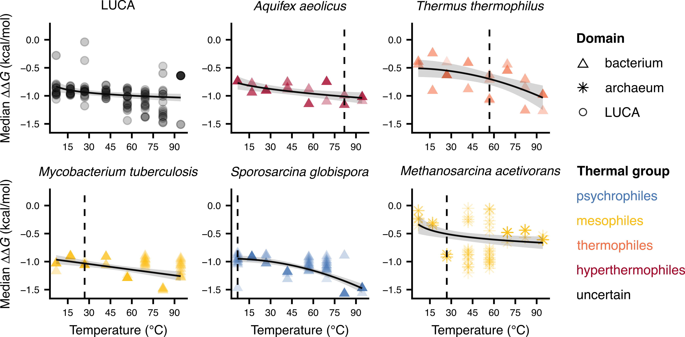

 

### Abstract:

Understanding whether and how temperature increases alter the effects of 
mutations on protein stability is crucial for understanding the limits 
to thermal adaptation by organisms. Currently, it is generally assumed 
that the stability effects of mutations are independent of temperature. 
Yet, mutations should become increasingly destabilizing as temperature 
rises due to the increase in the energy of atoms. Here, by performing 
an extensive computational analysis on the essential enzyme adenylate 
kinase in prokaryotes, we show, for the first time, that mutations 
become more destabilizing with temperature both across and within 
species. Consistent with these findings, we find that substitution 
rates of prokaryotes decrease nonlinearly with temperature. Our results 
suggest that life on Earth likely originated in a moderately 
thermophilic and thermally fluctuating environment, and indicate that 
global warming should decrease the per-generation rate of molecular 
evolution of prokaryotes.

[Full text](https://doi.org/10.1101/2020.10.13.337972)
\| [Code](https://github.com/dgkontopoulos/Kontopoulos_et_al_mutations_vs_temperature_2020)
\| [Data](https://doi.org/10.6084/m9.figshare.12635837.v1)
\| [citation](../bibtex/11_Higher_temperatures_worsen.bib)
