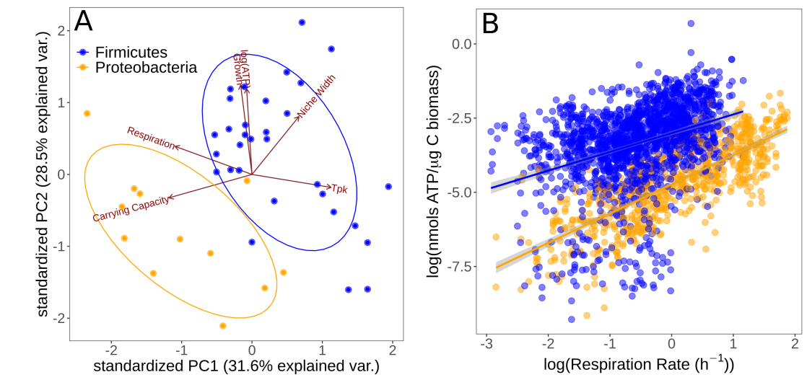

 

### Abstract:

Whether and how whole ecological communities can respond to climate change 
remains an open question. With their fast generation times and abundant 
functional diversity, microbes in particular harbor great potential to exhibit 
community-level adaptation through a combination of strain-level adaptation, 
phenotypic plasticity, and species sorting. However, the relative importance of 
these mechanisms remains unclear. Here, through a novel laboratory experiment, 
we show that bacterial communities can exhibit a remarkable degree of 
community-level adaptability through a combination of phenotypic plasticity and 
species sorting alone. Specifically, by culturing soil communities from a 
single location at six temperatures between 4°C and 50°C, we find that multiple 
strains well adapted to different temperatures can be isolated from the 
community, without immigration or strain-level adaptation. This is made 
possible by the ability of strains with different physiological and life 
history traits to "switch on" under suitable conditions, with phylogenetically 
distinct <i>K</i>-specialist taxa favoured under cooler conditions, and <i>r</i>-specialist 
taxa in warmer conditions. Our findings provide new insights into microbial 
community adaptation, and suggest that microbial community function is likely 
to respond rapidly to climatic fluctuations, through changes in species 
composition during repeated community assembly dynamics.

[Full text](https://doi.org/10.1101/2021.04.14.439774)
\| [citation](../bibtex/12_Latent_functional_diversity.bib)
