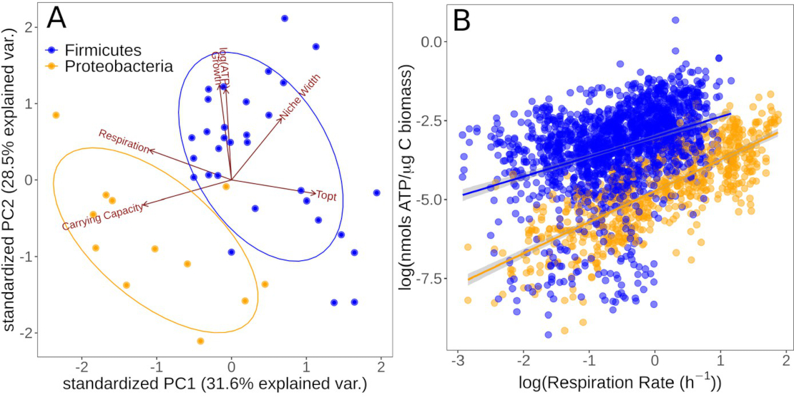

 

### Abstract:

How complex microbial communities respond to climatic fluctuations 
remains an open question. Due to their relatively short generation 
times and high functional diversity, microbial populations harbor great 
potential to respond as a community through a combination of strain-level 
phenotypic plasticity, adaptation, and species sorting. However, the 
relative importance of these mechanisms remains unclear. We conducted a 
laboratory experiment to investigate the degree to which bacterial 
communities can respond to changes in environmental temperature through 
a combination of phenotypic plasticity and species sorting alone. We 
grew replicate soil communities from a single location at six 
temperatures between 4°C and 50°C. We found that phylogenetically and 
functionally distinct communities emerge at each of these temperatures, 
with <i>K</i>-strategist taxa favored under cooler conditions and <i>r</i>-strategist 
taxa under warmer conditions. We show that this dynamic emergence of 
distinct communities across a wide range of temperatures (in essence, 
community-level adaptation) is driven by the resuscitation of latent 
functional diversity: the parent community harbors multiple strains 
pre-adapted to different temperatures that are able to 'switch on' at 
their preferred temperature without immigration or adaptation. Our 
findings suggest that microbial community function in nature is likely 
to respond rapidly to climatic temperature fluctuations through shifts 
in species composition by resuscitation of latent functional diversity.

[Full text](https://doi.org/10.7554/eLife.80867)
\| [Data and code](https://github.com/smithtp/latent-diversity)
\| [citation](../bibtex/12_Latent_functional_diversity.bib)
