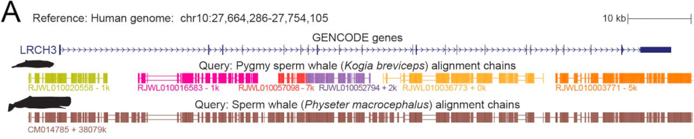

{{ page.title }} 
 

### Abstract:

Annotating coding genes and inferring orthologs are two classical 
challenges in genomics and evolutionary biology that have traditionally 
been approached separately, limiting scalability. We present TOGA (Tool to infer Orthologs from Genome Alignments), 
a method that integrates structural gene annotation and orthology inference. 
TOGA implements a different paradigm to infer orthologous loci, improves 
ortholog detection and annotation of conserved genes compared with state-of-the-art 
methods, and handles even highly fragmented assemblies. TOGA scales to 
hundreds of genomes, which we demonstrate by applying it to 488 
placental mammal and 501 bird assemblies, creating the largest 
comparative gene resources so far. Additionally, TOGA detects gene 
losses, enables selection screens, and automatically provides a 
superior measure of mammalian genome quality. TOGA is a 
powerful and scalable method to annotate and compare genes in the genomic era.

[Full text](https://doi.org/10.1126/science.abn3107)
\| [Preprint](https://doi.org/10.1101/2022.09.08.507143)
\| [Source code](https://github.com/hillerlab/TOGA)
\| [citation](../bibtex/13_TOGA.bib)
