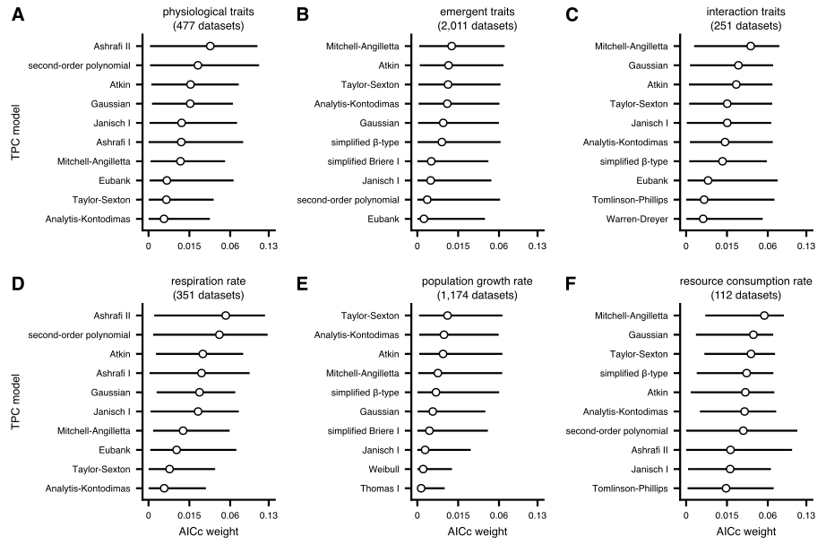

{{ page.title }} 
 

### Abstract:

In ectotherms, the performance of physiological, ecological and life-history 
traits universally increases with temperature to a maximum before decreasing 
again. Identifying the most appropriate thermal performance model for a 
specific trait type has broad applications, from metabolic modelling at the 
cellular level to forecasting the effects of climate change on population, 
ecosystem and disease transmission dynamics. To date, numerous mathematical 
models have been designed, but a thorough comparison among them is lacking. 
In particular, we do not know if certain models consistently outperform others 
and how factors such as sampling resolution and trait or organismal identity 
influence model performance. To fill this knowledge gap, we compile 2,739 
thermal performance datasets from diverse traits and taxa, to which we fit 
a comprehensive set of 83 existing mathematical models. We detect remarkable 
variation in model performance that is not primarily driven by sampling 
resolution, trait type, or taxonomic information. Our results reveal a surprising 
lack of well-defined scenarios in which certain models are more appropriate 
than others. To aid researchers in selecting the appropriate set of models 
for any given dataset or research objective, we derive a classification of 
the 83 models based on the average similarity of their fits.

[Full text](https://doi.org/10.1038/s41467-024-53046-2)
\| [Code](https://github.com/dgkontopoulos/Kontopoulos_et_al_83_TPC_models_2024)
\| [Data](https://doi.org/10.6084/m9.figshare.24106161.v3)
\| [citation](../bibtex/15_no_universal_mathematical_model.bib)
