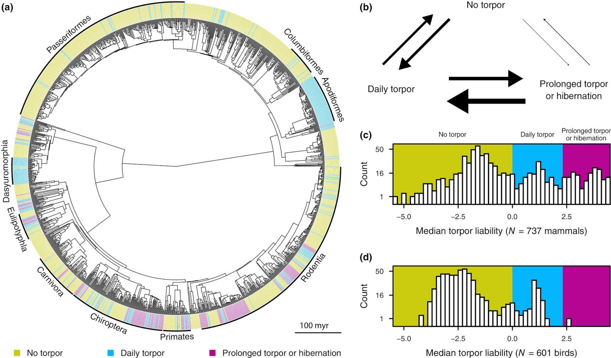

{{ page.title }} 
 

### Abstract:

    1. Many endotherms from diverse taxonomic groups can respond to 
    environmental changes through torpor, that is, by greatly reducing 
    their energy expenditure for up to 24 hours (daily torpor) or longer 
    (hibernation). We currently have a poor understanding of how torpor 
    evolved across endotherms and its associations with physiological 
    traits and ecological factors. 
    2. To fill this gap, we thoroughly examine the evolutionary patterns 
    of torpor and its links with 21 key physiological and ecological 
    variables across 1338 extant endotherms. 
    3. We find that daily torpor and hibernation are parts of an 
    evolutionary torpor continuum, and that there are several, albeit 
    weak, associations between torpor and species' physiological or 
    environmental characteristics. Furthermore, we show that early 
    endotherm ancestors likely did not hibernate and that this trait 
    evolved multiple times in independent lineages. 
    4. Overall, our results suggest that the remarkable variation in 
    torpor patterns across extant endotherms cannot solely be attributed 
    to environmental niches, but partly arises from independent gains of 
    daily torpor and hibernation in various clades.

[Full text](https://doi.org/10.1111/1365-2435.14739)
\| [Plain Language Summary](https://fesummaries.wordpress.com/2024/12/20/repeated-evolution-of-torpor-throughout-the-evolutionary-history-of-mammals-and-birds/)
\| [Code](https://github.com/dgkontopoulos/Kontopoulos_et_al_torpor_evolution_2025)
\| [Data](https://doi.org/10.6084/m9.figshare.24746283.v3)
\| [citation](../bibtex/16_Numerous_independent_gains.bib)
