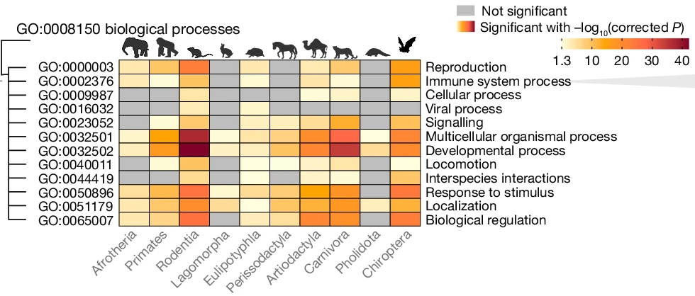

{{ page.title }} 
 

### Abstract:

Zoonoses are infectious diseases transmitted from animals to humans. 
Bats have been suggested to harbour more zoonotic viruses than any other 
mammalian order. Infections in bats are largely asymptomatic, indicating 
limited tissue-damaging inflammation and immunopathology. To investigate 
the genomic basis of disease resistance, the Bat1K project generated 
reference-quality genomes of ten bat species, including potential viral 
reservoirs. Here we describe a systematic analysis covering 115 mammalian 
genomes that revealed that signatures of selection in immune genes are 
more prevalent in bats than in other mammalian orders. We found an excess 
of immune gene adaptations in the ancestral chiropteran branch and in 
many descending bat lineages, highlighting viral entry and detection 
factors, and regulators of antiviral and inflammatory responses. ISG15, 
which is an antiviral gene contributing to hyperinflammation during 
COVID-19, exhibits key residue changes in rhinolophid and hipposiderid 
bats. Cellular infection experiments show species-specific antiviral 
differences and an essential role of protein conjugation in antiviral 
function of bat ISG15, separate from its role in secretion and 
inflammation in humans. Furthermore, in contrast to humans, ISG15 in 
most rhinolophid and hipposiderid bats has strong anti-SARS-CoV-2 
activity. Our work reveals molecular mechanisms that contribute to 
viral tolerance and disease resistance in bats.

[Full text](https://doi.org/10.1038/s41586-024-08471-0)
\| [Code](https://github.com/ariadnamorales/2023_Bat1Kimmunity)
\| [citation](../bibtex/17_Bat_genomes.bib)
