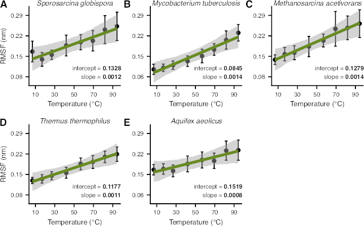

{{ page.title }} 
 

### Abstract:

Understanding the structural changes that enable enzymes to remain 
active in extreme thermal conditions is of broad scientific interest for 
both fundamental and applied biological research. Three key mechanisms 
that underlie the thermal adaptation of enzymes are modifications in 
structural flexibility, compactness, and the contacts formed among 
amino acids. However, most previous studies on these topics have been 
limited to small sample sizes or a narrow taxonomic focus, and the 
importance of these factors to thermal adaptation remains poorly 
understood. In this study, we combined molecular dynamics simulations 
and phylogenetic comparative analyses to thoroughly analyze the 
structural factors underlying thermal adaptation in adenylate kinase—a 
key enzyme involved in cellular energy balance and homeostasis—across 
70 prokaryotic species. We detect systematic increases in the flexibility 
of the enzyme with temperature, both across and within species. In 
contrast, structural compactness appears to be almost completely 
independent of temperature. Finally, we uncover a remarkable diversity 
in the number and types of amino acid contacts observed in different 
adenylate kinases that cannot be explained solely by temperature. Our 
results suggest that there are multiple paths toward the adaptation of 
prokaryotic adenylate kinases to extreme thermal environments and that 
these paths are generally accessible through changes in flexibility.

[Full text](https://academic.oup.com/evlett/advance-article/doi/10.1093/evlett/qraf026/8223096)
\| [Code](https://codeberg.org/dgkontopoulos/Kontopoulos_et_al_evolution_of_ADK_structures_2025)
\| [Data](https://doi.org/10.6084/m9.figshare.28436891)
\| [citation](../bibtex/18_Changes_in_flexibility_but_not.bib)
