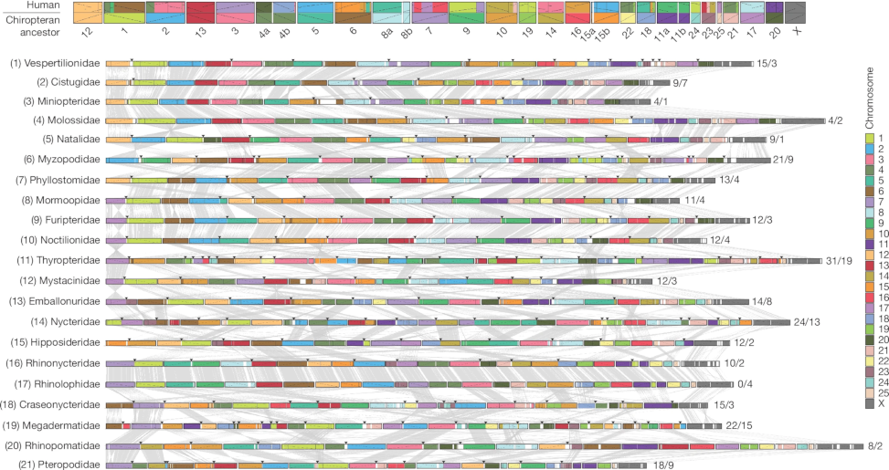

{{ page.title }} 
 

### Abstract:

Bats are extraordinary among mammals, having uniquely evolved powered 
flight and laryngeal echolocation, along with disease resistance, 
extended healthspans and the ability to hibernate. However, the 
evolutionary history of bats and the understanding of these adaptations 
remain unresolved. We analysed chromosome-level, long-read genome assemblies 
from 103 bat species, including 42 new assemblies, representing all 21 
bat families. This dataset, expanded in scope and assembly quality, 
yielded a new bat phylogeny. We placed Myzopodidae as the earliest 
branch within Vespertilionoidea, and resolved yangochiropteran 
relationships, identifying Emballonuroidea and Vespertilionoidea as 
sister groups. Our analysis revealed a mosaic evolutionary history 
across bats and explained why previous phylogenetic studies were misled. 
Chromosomal ancestral-state reconstructions supported 26 ancestral bat 
chromosomes. We integrated a morphological dataset of 699 characters for 
65 species, including 44 pre-Quaternary fossils and representatives of 
most living bat families, with neutrally evolving genomic sites. 
Fossilized birth–death and dispersal–extinction cladogenesis analyses 
showed that bats, and thus powered flight, probably originated in Europe 
in the late Palaeocene, refuting African and North American origins. 
Placement of the fossil †<i>Vielasia</i> in the oldest `Eochiroptera' clade 
indicates that laryngeal echolocation predates crown-bat diversification. 
Total evidence dating, including the fossil taxa, significantly reduced 
unrepresented basal branch lengths compared with molecular-only divergence 
estimates. By integrating comprehensive genomic and morphological datasets, 
analysed using innovative methods, we resolve long-standing controversies 
in bat biology and provide new insights into the evolutionary history 
and trait diversification of bats.

[Full text](https://doi.org/10.1038/s41586-026-11007-3)
\| [Code](https://github.com/Bat1K-21families/21families-analyses)
\| [Data](https://doi.org/10.5061/dryad.1rn8pk187)
\| [citation](../bibtex/21_Reference_genomes_and_fossils.bib)
